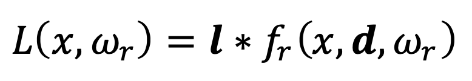
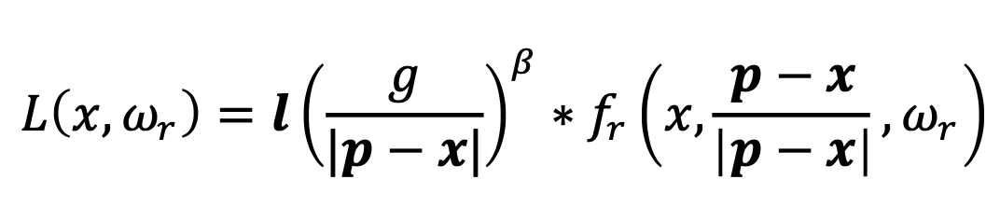

# Assignment 10a

## Directional 

## Point w/o decay 

## Directional with ambient

## Point w/ decay 

## Spotlight with decay 

## Directional with hemispheric ambient

## Three lights: a directional, a point and a spot

